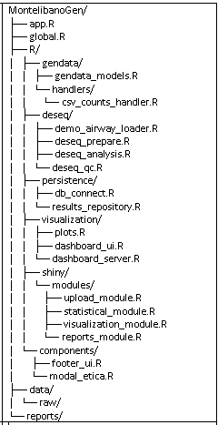

# Nombre del Proyecto

Aplicación web desarrollada en **R Shiny** para análisis transcriptómico
mediante **DESeq2**, orientada a investigación biomédica y académica.

------------------------------------------------------------------------

## Arquitectura

------------------------------------------------------------------------

## Descripción general

Esta plataforma permite cargar datasets públicos o locales, realizar
análisis diferencial de expresión génica y generar visualizaciones
interactivas y reportes exportables.

**No está destinada a uso clínico directo.**

------------------------------------------------------------------------

## Funcionalidades principales

-   Carga de datasets públicos (ej. airway) y archivos locales
-   Análisis diferencial con DESeq2
-   Visualización interactiva de resultados
-   Exportación de reportes
-   Arquitectura modular (Shiny Modules)

------------------------------------------------------------------------

## Tecnologías utilizadas

-   R 4.5.1
-   Shiny
-   DESeq2
-   ggplot2 / plotly
-   renv (reproducibilidad)

------------------------------------------------------------------------

## Instalación local

\`\`\`r install.packages("renv") renv::restore() shiny::runApp()
